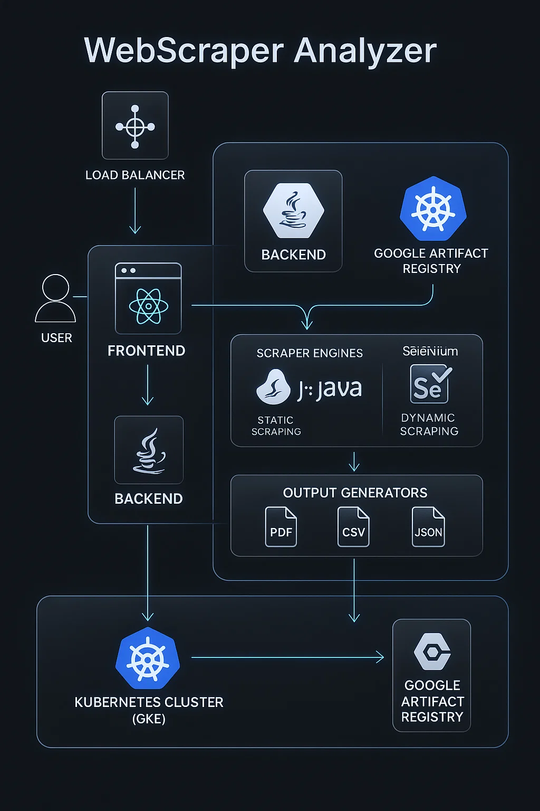

# 🌐 WebScraper Analyzer

A full-stack, cloud-deployed smart web-scraping system built with **React**, **Spring Boot**, **JSoup**, **Selenium**, **Docker**, and **Google Kubernetes Engine (GKE)** — capable of scraping static & dynamic websites, extracting metadata, analyzing keywords, crawling nested URLs, taking screenshots (dynamic mode), and exporting results as **PDF**, **CSV**, and **JSON**, all stored securely in **Google Cloud Storage**.

---

## 🚀 Live Deployment

### 🔵 Frontend (Public UI)  
👉 http://35.200.219.140/

### 🟣 Backend API (GKE LoadBalancer)

**Single URL Analysis**  
http://34.100.164.25:8080/api/analyze

**Multi-URL Analysis**  
http://34.100.164.25:8080/api/analyze/multi

## 🎬 Demo Video (MP4)

https://github.com/Anusha-Sundar-2912/webscraper-analyzer-gcp/blob/main/assets/demo.mp4

## 🧭 System Architecture  


---

## ✨ Features

### 🔍 Scraping Modes
- **JSoup (Static Scraping)**
- **Selenium (Dynamic Scraping + Screenshots)**
- **Deep Scrape (Nested URLs)**

### 📤 Output Generators
- PDF Report  
- CSV Summary  
- JSON Metadata  
- Screenshots (Dynamic mode)

### ☁️ Cloud-Native Pipeline
- Automatic upload to **Google Cloud Storage**
- Public download links for reports & screenshots
- Kubernetes scaling for frontend & backend

---

## 📥 API Usage

### 🔹 Single URL Request  
`POST /api/analyze`
```json
{
  "url": "https://example.com",
  "keywords": ["example", "domain"],
  "mode": "jsoup",
  "deep": false
}
```

### 🔹 Multi-URL Request  
`POST /api/analyze/multi`
```json
{
  "urls": ["https://example.com", "https://wikipedia.org"],
  "keywords": ["web", "info"],
  "mode": "selenium",
  "deep": false
}
```

---

## 🛠️ Tech Stack

### 🎨 Frontend
- React  
- Tailwind CSS  
- Axios  
- Chart.js  

### 🔧 Backend
- Java 17  
- Spring Boot  
- JSoup  
- Selenium WebDriver  
- Lombok  
- PDFBox, OpenCSV  

### ☁️ Cloud & DevOps
- Google Kubernetes Engine (GKE)  
- Google Artifact Registry  
- Google Cloud Storage  
- Docker  
- Kubernetes Deployments & LoadBalancers  

---

## 📦 Deployment Workflow
1. Build frontend & backend Docker images  
2. Push images to **Google Artifact Registry**  
3. Deploy to **Google Kubernetes Engine** using YAML manifests  
4. GKE assigns external IPs via **LoadBalancer**  
5. Backend processes requests and stores outputs in **GCS**  
6. Frontend consumes API + displays results with charts & links  

---

## 📂 Folder Structure  
```
webscraper-analyzer/
│
├── backend/
│   ├── src/main/java/com/webscraper/backend/
│   │   ├── controller/
│   │   ├── model/
│   │   ├── service/
│   │   └── util/
│   ├── Dockerfile
│   └── pom.xml
│
├── frontend/
│   ├── src/
│   ├── public/
│   ├── Dockerfile
│   └── package.json
│
└── manifests/
    ├── backend-deployment.yaml
    ├── frontend-deployment.yaml
    ├── service-backend.yaml
    ├── service-frontend.yaml
```

---

## ✔️ Highlights
- Cloud-native & production ready  
- Handles dynamic JS-heavy sites  
- Beautiful UI with dark/light mode  
- Deep crawling + keyword analysis  
- Public API + Public frontend  

---

